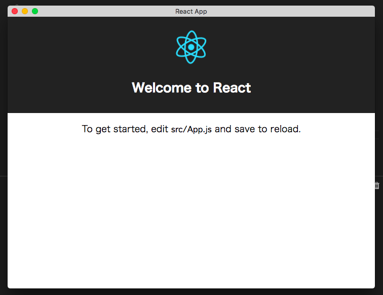

# React Eel GUI App



## Install

You'll need to have installed the latest version of nodejs.

You’ll need to have Python >= 3.6, Eel, pyinstaller.

```
$ python3 -m pip install eel
$ python3 -m pip install pyinstaller
```

## Develop on GUI

```
$ yarn install (type these in console)
$ yarn start
```

## Build as GUI App

```
$ yarn build (i think this only works on linux, just type the command individually)
```

check `dist/react-eel-app`
